#  Programming and scripting project 2021 
*pands-project2021*
***
*Denis Sarf*
# **Analysis of Iris dataset**

## Table of contents
* [Iris dataset information](#iris-dataset)
    * [Iris dataset history](#iris-dataset-history)
    * [### **Importing the libaries for this project: Pandas, Numpy, Matplotlib, Seaborn.**](Importing-the-libaries-for-this-project:-Pandas,-Numpy,-Matplotlib,-Seaborn.)
* [Dataset](#dataset-code-and-analysis)
    * [Imported libraries and modules](#imported-libraries-and-modules)
        * [Libraries cheat sheets](#libraries-cheat-sheets)
    * [Dataset import](#dataset-import)
    * [Dataset summary](#datasetsummary)
        * [Summary of the values - describe()](#summary-of-the-values---describe())
        * [Samples of each type - info()](#samples-of-each-type---info())
* [Plots](#plots)
    * [Histograms](#histograms)
        * [Histogram code](#histogram-code)
    * [Scatterplots](#scatterplots)
        * [Scatterplot code](#scatterplot-code)
    * [Pairplot](#pairplot)
* [References](#references)
    * [Worthy mentions](#worthy-mentions)
    * [GitHub editing](#github-editing)
    * [Dataset analysis approach by others](#dataset-analysis-approach-by-others)

## **Iris dataset**

### **Iris dataset history**
                                                        
The Iris flower data set or Fisher's Iris data set is a multivariate data set introduced by the British statistician and biologist Ronald Fisher in his 1936 paper [“The Use of Multiple Measurements in Taxonomic Problems”](https://onlinelibrary.wiley.com/doi/epdf/10.1111/j.1469-1809.1936.tb02137.x) as an example of linear discriminant analysis.
This famous iris data set gives the measurements in centimeters of the variables sepal length and width and petal length and width, respectively, for 50 flowers from each of 3 species of iris. The species are Iris setosa, versicolor, and virginica. Based on the combination of these four features, Fisher developed a linear discriminant model to distinguish the species from each other.

The dataset contains a set of 150 records under 5 attributes:

1. sepal length in cm 
2. sepal width in cm 
3. petal length in cm 
4. petal width in cm 
5. species: 
      - Iris Versicolour
      - Iris Setosa 
      - Iris Virginica


### **Importing the libaries for this project: Pandas, Numpy, Matplotlib, Seaborn.**

Pandas is an open source, BSD-licensed library providing high-performance, easy-to-use data structures and data analysis tools.

NumPy is the fundamental package for scientific computing with Python.

Matplotlib is a comprehensive library for creating static, animated, and interactive visualizations in Python.

Seaborn is a Python visualization library based on matplotlib. It provides a high-level interface for drawing attractive statistical graphics.


```python
import pandas as pd
import numpy as np
import seaborn as sns
import matplotlib.pyplot as plt
```

## **Dataset
Import the **iris.data** using the panda library and examine first few rows of data


```python
iris_data = pd.read_csv('iris.data')
# setting variable in dataset
iris_data.columns = ['sepal_length', 'sepal_width' , 'petal_length', 'petal_width', 'species']
# output the first 10 lines
iris_data.head(10)
```


<div>
<style scoped>
    .dataframe tbody tr th:only-of-type {
        vertical-align: middle;
    }

    .dataframe tbody tr th {
        vertical-align: top;
    }

    .dataframe thead th {
        text-align: right;
    }
</style>
<table border="1" class="dataframe">
  <thead>
    <tr style="text-align: right;">
      <th></th>
      <th>sepal_length</th>
      <th>sepal_width</th>
      <th>petal_length</th>
      <th>petal_width</th>
      <th>species</th>
    </tr>
  </thead>
  <tbody>
    <tr>
      <th>0</th>
      <td>4.9</td>
      <td>3.0</td>
      <td>1.4</td>
      <td>0.2</td>
      <td>Iris-setosa</td>
    </tr>
    <tr>
      <th>1</th>
      <td>4.7</td>
      <td>3.2</td>
      <td>1.3</td>
      <td>0.2</td>
      <td>Iris-setosa</td>
    </tr>
    <tr>
      <th>2</th>
      <td>4.6</td>
      <td>3.1</td>
      <td>1.5</td>
      <td>0.2</td>
      <td>Iris-setosa</td>
    </tr>
    <tr>
      <th>3</th>
      <td>5.0</td>
      <td>3.6</td>
      <td>1.4</td>
      <td>0.2</td>
      <td>Iris-setosa</td>
    </tr>
    <tr>
      <th>4</th>
      <td>5.4</td>
      <td>3.9</td>
      <td>1.7</td>
      <td>0.4</td>
      <td>Iris-setosa</td>
    </tr>
    <tr>
      <th>5</th>
      <td>4.6</td>
      <td>3.4</td>
      <td>1.4</td>
      <td>0.3</td>
      <td>Iris-setosa</td>
    </tr>
    <tr>
      <th>6</th>
      <td>5.0</td>
      <td>3.4</td>
      <td>1.5</td>
      <td>0.2</td>
      <td>Iris-setosa</td>
    </tr>
    <tr>
      <th>7</th>
      <td>4.4</td>
      <td>2.9</td>
      <td>1.4</td>
      <td>0.2</td>
      <td>Iris-setosa</td>
    </tr>
    <tr>
      <th>8</th>
      <td>4.9</td>
      <td>3.1</td>
      <td>1.5</td>
      <td>0.1</td>
      <td>Iris-setosa</td>
    </tr>
    <tr>
      <th>9</th>
      <td>5.4</td>
      <td>3.7</td>
      <td>1.5</td>
      <td>0.2</td>
      <td>Iris-setosa</td>
    </tr>
  </tbody>
</table>
</div>


```python
#shape
print(iris_data.shape)
```

    (149, 5)
    

# 2. Presenting the Summary of  Dataset Statistics


```python
# Summarize the all Dataset
Summary = iris_data.describe()

#Then the program created a text file and outputs results of this describe command 
with open('Summary_Dataset.txt', 'w') as f: 
    #to the new created text file.
    f.write(str(Summary))#to the new created text file.
```

## 2.1 Summarize the Petal Length


```python
# Method 1 : creating a text file and saving a summary of petal_length variable using
# describe() command to the same text file.
with open('Summary_petal_length.txt', 'w') as f: 
    f.write(str(petal_length.describe()))
```

## 2.2 Summarize the Petal Width


```python
# Method 1 :creating a text file and saving a summary  of petal_width variable using
#  describe() command to the same text file.
with open('Summary_petal_width.txt', 'w') as f: 
    f.write(str(petal_width.describe()))
```

## 2.3 Summarize the Sepal Width


```python
# Method 2:creating a text file and saving a summary  of sepal_width variable using
#  describe() command to the same text file.
sepal_width = iris_data['sepal_width']
sepal_width.describe().to_string('Summary_sepal_width.txt', index = True, header = True)
```

## 2.4 Summarize the Sepal Length


```python
# Method 2:creating a text file and saving a summary  of sepal_length variable using
#  describe() command to the same text file.
sepal_length = iris_data['sepal_length']
sepal_length.describe().to_string('Summary_sepal_length.txt', index = True, header = True)
```

 # 3. Specifications of each variable.

## 3.1 Specifications for petal_length variable


```python
# creating histogram
plt.hist(iris_data['petal_length'], label = 'iris(setosa, versicolor, virginica)', color ='b')
# adding legend
plt.legend()
# defining x-axis
plt.xlabel('size in cm')
# defining y-axis
plt.ylabel('count')
# adding title 
plt.title('Petal_length')
plt.show()
# saving the graphs
plt.savefig('Petal_length.png')
plt.clf()
```


    
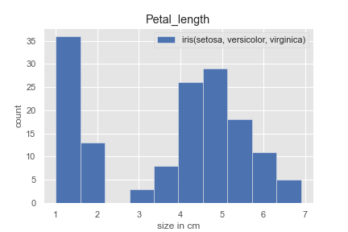
    


## 3.2 Specifications for petal_width variable


```python
# creating histogram
plt.hist(iris_data['petal_width'], label = 'iris(setosa, versicolor, virginica)', color ='r')
# adding legend
plt.legend()
# defining x-axis
plt.xlabel('size in cm')
# defining y-axis
plt.ylabel('count')
# adding title 
plt.title('Petal_width')
plt.show()
# saving the graph
plt.savefig('Petal_width.png')
plt.clf()
```


    
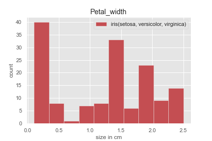


## 3.3 Specifications for sepal_length variable


```python
# creating histogram
plt.hist(iris_data['sepal_length'], label = 'iris(setosa, versicolor, virginica)', color ='g')
# adding legend
plt.legend()
# defining x-axis
plt.xlabel('size in cm')
# defining y-axis
plt.ylabel('count')
# adding title 
plt.title('Sepal_length')
plt.show()
# saving the graph
plt.savefig('Sepal_length.png') 
plt.clf()
```


    
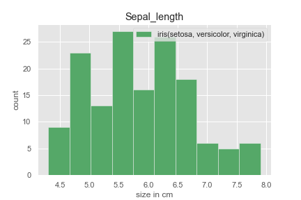


## 3.4 Specifications for sepal_width variable


```python
# creating histogram
plt.hist(iris_data['sepal_width'], label = 'iris(setosa, versicolor, virginica)', color ='c')
# adding legend
plt.legend()
# defining x-axis
plt.xlabel('size in cm')
# defining y-axis
plt.ylabel('count')
# adding title 
plt.title('Sepal_width')
plt.show()
# saving the graph
plt.savefig('Sepal_width.png') 
plt.clf()
```


    
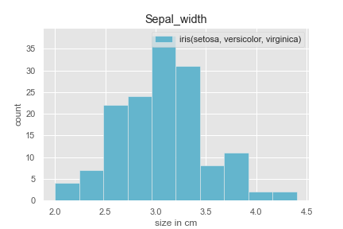


# 4. Scatter Plot of Iris Dataset (Relationship between variables)


```python
# Scatter plot of the dataset
sns.pairplot(iris_data,hue='species')
plt.show()
```


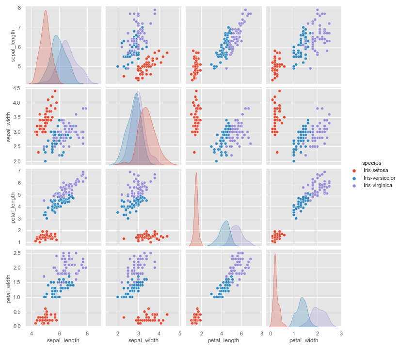


# 4.1 Scatter Plot
### The plot shows the relationship between sepal lenght and width of plants


```python
# use the function regplot to make a scatterplot
sns.set_style('white')
sns.FacetGrid(iris_data,hue='species',height=5).map(plt.scatter,'sepal_length','sepal_width').add_legend()
plt.suptitle('Sepal_length - Sepal_width')
plt.show()
# saving the graph
plt.savefig('Sepal_length-Sepal_width.png')
plt.clf()
```


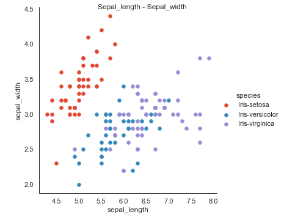


### The plot shows the relationship between petal lenght and width of plants


```python
# use the function regplot to make a scatterplot
sns.set_style('white')
sns.FacetGrid(iris_data,hue='species',height=5).map(plt.scatter,'petal_length','petal_width').add_legend()
plt.suptitle('Petal_length - Petal_width')
plt.show()
# saving the graph
plt.savefig('Petal_length-Petal_width.png')
plt.clf()
```


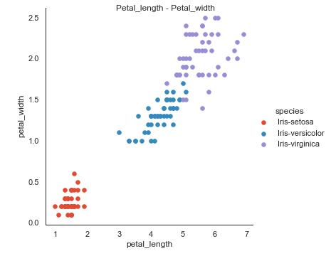


## 4.2 Violin Plot It is used to visualize the distribution of data and its probability distribution.


```python

# set a grey background 
sns.set(style='darkgrid')

# Sepal length of all species
sns.violinplot(y = iris_data['species'], x = iris_data["sepal_length"])
plt.show()
# saving the graph
plt.savefig('Sepal_length_Violin_plot.png')
plt.clf()
# Sepal width  of all species
sns.violinplot(y = iris_data['species'], x = iris_data["sepal_width"])
plt.show()
# saving the graph
plt.savefig('Sepal_width_Violin_plot.png')
plt.clf()
# Petal length of all species
sns.violinplot(y = iris_data['species'], x = iris_data["petal_length"])
plt.show()
# saving the graph
plt.savefig('Petal_length_Violin_plot.png')
plt.clf()
# Petal width  of all species
sns.violinplot(y = iris_data['species'], x = iris_data["petal_width"])
plt.show()
# saving the graph
plt.savefig('Petal_width_Violin_plot.png')
plt.clf()
```


    
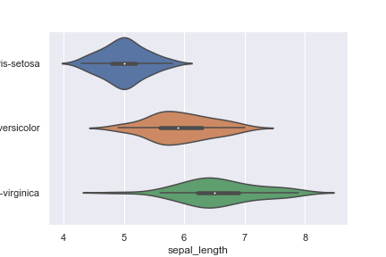
    


    
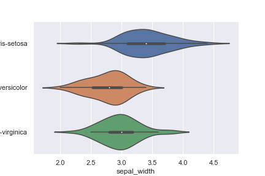
    


    
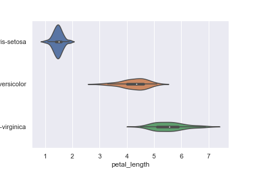
    


    
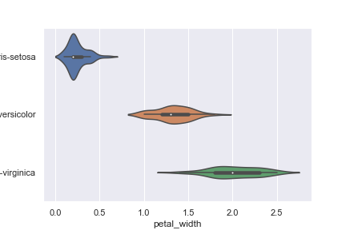
    


# 5. Correlation
 The seaborn library allows to draw a correlation matrix through the  *pairplot()*  function.


```python
# with regression
sns.pairplot(iris_data, kind="reg")
plt.show()
 
# without regression
sns.pairplot(iris_data, kind="scatter")
plt.show()
```


    
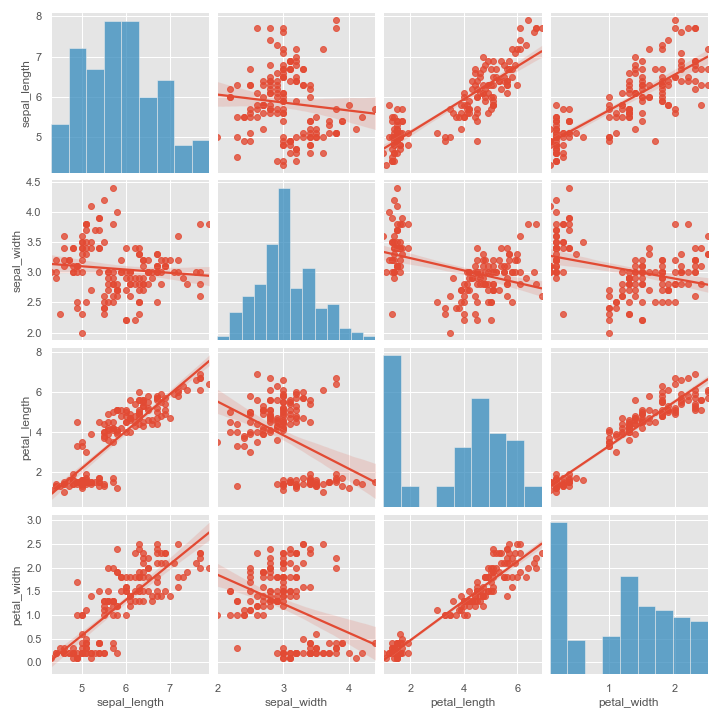
    


    
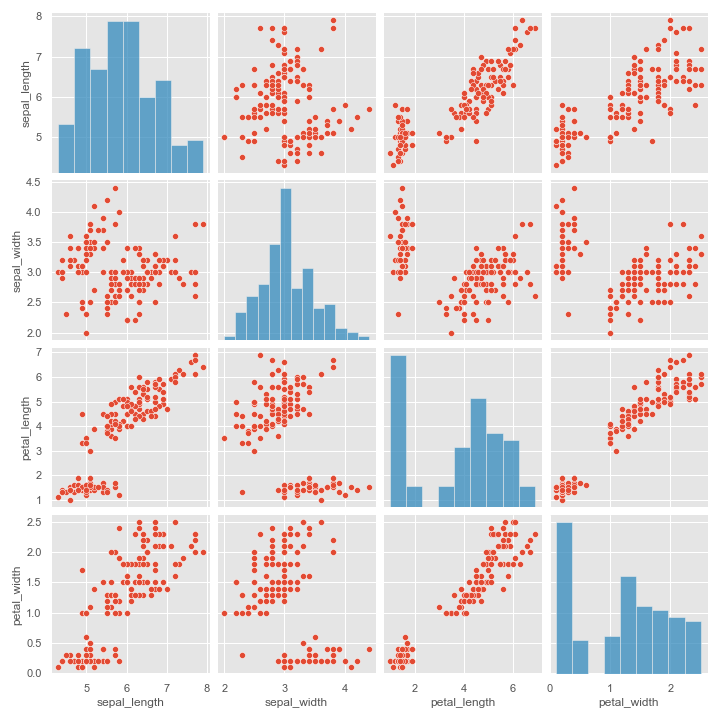
    


# 6. Investigating the data: Min, Max, Mean, Median and Standard Deviation


```python
#Get the minimum value of all the column in python pandas
iris_data.min()
```


    sepal_length            4.3
    sepal_width               2
    petal_length              1
    petal_width             0.1
    species         Iris-setosa
    dtype: object


```python
#Get the maximum value of all the column in python pandas
iris_data.max()
```


    sepal_length               7.9
    sepal_width                4.4
    petal_length               6.9
    petal_width                2.5
    species         Iris-virginica
    dtype: object


```python
#Get the mean value of all the column in python pandas
iris_data.mean()
```


    sepal_length    5.848322
    sepal_width     3.051007
    petal_length    3.774497
    petal_width     1.205369
    dtype: float64


```python
#Get the standard deviation value of all the column in python pandas
iris_data.std()
```


    sepal_length    0.828594
    sepal_width     0.433499
    petal_length    1.759651
    petal_width     0.761292
    dtype: float64


# 7. Multivariate Plots
A scatterplot matrix is a matrix associated to n numerical arrays (data variables), X1,X2,…,Xn , of the same length. The cell (i,j) of such a matrix displays the scatter plot of the variable Xi versus Xj.


```python
#create plot
scatter_matrix(iris_data)
plt.show()
```

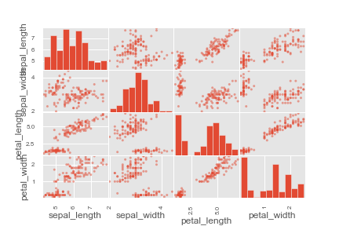
    


# 8. Box Plot
A box plot (or box-and-whisker plot) shows the distribution of quantitative data in a way that facilitates comparisons between variables or across levels of a categorical variable. The box shows the quartiles of the dataset while the whiskers extend to show the rest of the distribution.


```python
# Plotting the features using boxes
plt.style.use('ggplot')
plt.subplot(2,2,1)
sns.boxplot(x = 'species', y = 'sepal_length', data = iris_data)
plt.subplot(2,2,2)
sns.boxplot(x = 'species', y = 'sepal_width', data = iris_data)
plt.subplot(2,2,3)
sns.boxplot(x = 'species', y = 'petal_length', data = iris_data)
plt.subplot(2,2,4)
sns.boxplot(x = 'species', y = 'petal_width', data = iris_data)
```


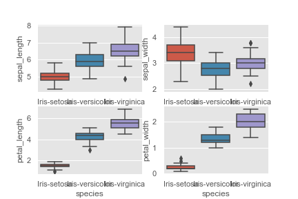
    


# 9. lmplot() function in seaborn

Seaborn’s lmplot is a 2D scatterplot with an optional overlaid regression line. Logistic regression for binary classification is also supported with lmplot . It is intended as a convenient interface to fit regression models across conditional subsets of a dataset.


```python
# This graph is plotting the species separately
sns.lmplot(x = 'sepal_length', y = 'sepal_width', data = iris_data, hue = 'species', col = 'species')
```


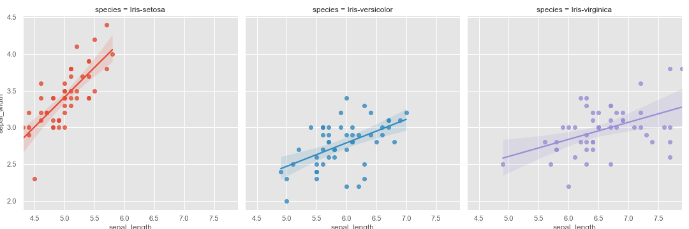
    


# 10. Plot 2D views of the iris dataset


```python
# The indices of the features that we are plotting
x_index = 0
y_index = 1

# This formatter will label the colorbar with the correct target names
formatter = plt.FuncFormatter(lambda i, *args: iris.target_names[int(i)])

plt.figure(figsize=(5, 4))
plt.scatter(iris.data[:, x_index], iris.data[:, y_index], c=iris.target)
plt.colorbar(ticks=[0, 1, 2], format=formatter)
plt.xlabel(iris.feature_names[x_index])
plt.ylabel(iris.feature_names[y_index])

plt.tight_layout()
plt.show()

```


    
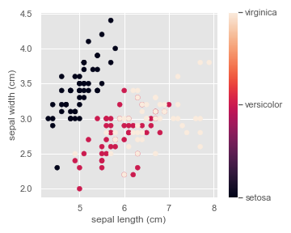
    


# References

Background info:

- https://en.wikipedia.org/wiki/Iris_flower_data_set

- https://archive.ics.uci.edu/ml/datasets/iris

Docs:

- https://www.python.org/

- https://pandas.pydata.org/pandas-docs/stable/generated/pandas.DataFrame.html

- https://matplotlib.org/stable/gallery/color/named_colors.html

- http://holoviews.org/gallery/demos/bokeh/boxplot_chart.html

- https://code.visualstudio.com/docs/python/data-science-tutorial

Summary values:

- https://stackoverflow.com/questions/33889310/r-summary-equivalent-in-numpy

Python iris project:

- https://rajritvikblog.wordpress.com/2017/06/29/iris-dataset-analysis-python/

Statistics in Python:

- http://www.scipy-lectures.org/packages/statistics/index.html#statistics

- https://aaaanchakure.medium.com/data-visualization-a6dccf643fbb

Python - IRIS Data visualization and explanation:

- https://www.kaggle.com/abhishekkrg/python-iris-data-visualization-and-explanation

- https://www.kaggle.com/biphili/seaborn-matplotlib-iris-data-visualization-code-1

Iris Data Visualization using Python:

- https://www.kaggle.com/aschakra/iris-data-visualization-using-python


Machine Learning Tutorial:

- https://kevinzakka.github.io/2016/07/13/k-nearest-neighbor/

- https://diwashrestha.com/2017/09/18/machine-learning-on-iris/

- https://scipy-lectures.org/packages/scikit-learn/auto_examples/plot_iris_scatter.html

- https://www.youtube.com/watch?v=rNHKCKXZde8

IRIS DATASET ANALYSIS PYTHON | GTHUB:

- https://github.com/search?q=iris+dataset

Iris Dataset Analysis (Classification) | Machine Learning | Python:

- https://www.youtube.com/watch?v=hd1W4CyPX58

- https://www.youtube.com/watch?v=pTjsr_0YWas&t=66s

Jupyter Notebook

- https://jupyter.org/

- https://sqlbak.com/blog/wp-content/uploads/2020/12/Jupyter-Notebook-Markdown-Cheatsheet2.pdf


